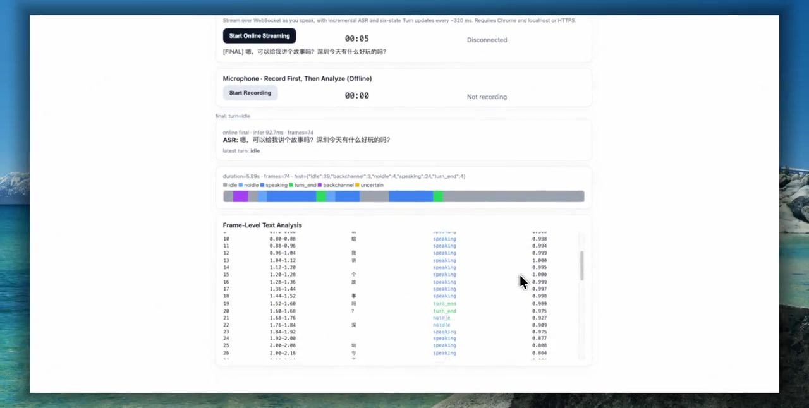
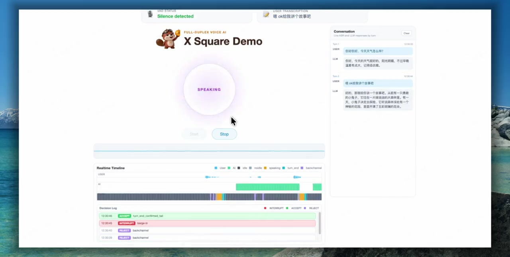

<div align="center">
  <h1>
    
    X2-Turn
  </h1>
  <p>
    <strong>Frame-synchronous streaming ASR and Turn-state prediction</strong>
  </p>
  <p>
    <a href="https://huggingface.co/Kaiqfu/X2-Turn-4B-0812"></a>
    <a href="https://arxiv.org/abs/2608.10878"></a>
    
    <a href="LICENSE"></a>
  </p>
</div>

[English](README.md) | [Chinese](README_zh.md)

## Overview

X2 Turn extends Voxtral Realtime with two synchronized outputs: streaming
automatic speech recognition and one turn-taking prediction every 80 ms.

The turn head predicts `idle`, `noidle`, `speaking`, `turn_end`,
`backchannel`, or `uncertain`. Applications should smooth these frame-level
predictions instead of treating a single frame as an irreversible action.

## Demos

This repository includes two complementary browser demos:

- **[Turn Demo](turn-demo/README.md)** visualizes streaming ASR, the raw
  six-class Turn timeline, per-frame probabilities, and aligned ASR tokens. It
  runs without an LLM or TTS service and is the fastest way to inspect model
  behavior.
- **[Full-Duplex Dialogue Demo](full-duplex-demo/README.md)** combines X2 Turn
  with optional LLM and TTS services to demonstrate low-latency response timing,
  backchannels, and user interruption during speech playback.

Start with the Turn Demo when evaluating the model itself. Use the Full-Duplex
Dialogue Demo when validating a complete conversational stack.

### Turn Demo video

Click the preview to watch live ASR, the six-class Turn timeline, and
frame-level predictions without an LLM or TTS service.

[](turn_demo_web.mp4)

### Full-Duplex Dialogue Demo video

Click the preview to watch streaming ASR, turn-state tracking, response
generation, speech playback, and user interruption in one session.

[](dialogue_demo_web.mp4)

## Quick start: one audio file

Recommended Miniforge setup, run from the repository root:

```bash
conda env create -f environments/environment-transformers.yml
conda activate x2-turn
```

Or install the local Transformers integration with pip:

```bash
cd voxtral-realtime
python -m pip install -e ".[transformers]"
```

Load the model without modifying Transformers or enabling
`trust_remote_code`, then obtain both the transcript and all aligned turn
frames:

```python
import torch
from transformers import AutoProcessor

from voxtral_realtime.transformers import (
    infer_asr_turn,
    load_mtp_checkpoint,
)

model_id = "Kaiqfu/X2-Turn-4B-0812"
processor = AutoProcessor.from_pretrained(model_id)
model = load_mtp_checkpoint(
    model_id,
    device="cuda",
    dtype=torch.bfloat16,
).eval()

result = infer_asr_turn(model, processor, "turn-demo/assets/sample_en.wav")

print("ASR:", result.transcript)
for frame in result.turn_frames:
    print(frame.start_ms, frame.end_ms, frame.label, frame.confidence)
```

The published Hub model is `Kaiqfu/X2-Turn-4B-0812`. For offline or private
deployments, `model_id` can instead be a local checkpoint directory.

For a ready-to-run command that also writes JSON:

```bash
python voxtral-realtime/integrations/transformers/examples/offline_inference.py \
  --model Kaiqfu/X2-Turn-4B-0812 \
  --audio turn-demo/assets/sample_en.wav \
  --output offline_frames.json
```

The bundled sample is synthetic 16 kHz mono speech. Its text, provenance,
license, and reproducible FFmpeg command are documented in
[`turn-demo/assets/README.md`](turn-demo/assets/README.md).

## Repository layout

- [`voxtral-realtime/`](voxtral-realtime/README.md) contains the model wrapper,
  local ASR + turn inference, the realtime controller, and the patched vLLM
  integration. Start here when integrating the model into another project.
- [`turn-demo/`](turn-demo/README.md) is the focused browser demo for testing
  raw ASR, 80 ms Turn states, and the frame-level token/class/probability table
  without an LLM, TTS service, or product decision policy.
- [`full-duplex-demo/`](full-duplex-demo/README.md) is the browser-based
  full-duplex dialogue demo that combines X2 Turn with optional LLM and TTS
  services.

[`environments/`](environments/README.md) provides separate Miniforge
environments for local Transformers inference, patched vLLM, and the
full-duplex dialogue stack. Keeping these environments separate avoids most
Torch and CUDA dependency conflicts.

For realtime serving, follow the
[`vLLM integration guide`](voxtral-realtime/integrations/vllm/README.md).
Stock vLLM does not emit the custom `turn.delta` events.

## Citation

If you find X2-Turn useful in your research, please cite:

```bibtex
@article{fu2026x2turn,
  title = {X2-Turn: Frame-Synchronous Dual-Head Modeling for Joint Streaming ASR and Turn State Prediction},
  author = {Fu, Kaiqi and Wen, Rime and Lin, Altman and Qin, Shawn and Gan, Roy and Wang, Hao and Wang, Qian},
  journal = {arXiv preprint arXiv:2608.10878},
  year = {2026},
}
```

## Acknowledgments

X2 Turn builds on ideas, models, and infrastructure from the open-source speech
and machine-learning community. We thank:

- [Mistral AI](https://mistral.ai/) for
  [Voxtral Mini 4B Realtime](https://huggingface.co/mistralai/Voxtral-Mini-4B-Realtime-2602),
  which provides the realtime speech backbone.
- [SoulX-Duplug](https://github.com/Soul-AILab/SoulX-Duplug) for its semantic
  turn-taking work and the dialogue-system foundation adapted by the
  full-duplex demo.
- [vLLM](https://github.com/vllm-project/vllm) for the high-throughput serving
  runtime extended by the X2 Turn realtime overlay.
- [Hugging Face Transformers](https://github.com/huggingface/transformers) for
  model loading, processing, and the local inference ecosystem.
- [CosyVoice](https://github.com/FunAudioLLM/CosyVoice) for the optional
  streaming TTS integration used by the full-duplex demo.

See the component `NOTICE` files and the available `THIRD_PARTY_NOTICES.md`
documents for detailed attribution and license information.
